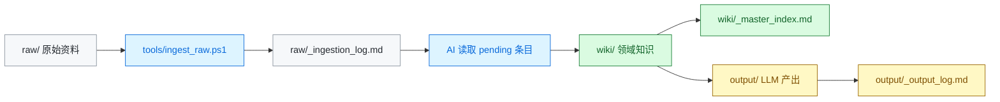

<div align="center">

<h1>Knowledge Vault</h1>
<p><strong>AI 辅助个人知识库</strong></p>

<p>
  <a href="https://github.com/KkOma-value/vault/commits/master"></a>
  <a href="https://github.com/KkOma-value/vault"></a>
  <a href="tools/ingest_raw.ps1"></a>
</p>

<p><strong><code>raw</code> &rarr; <code>wiki</code> &rarr; <code>output</code></strong></p>

<p>把原始资料、AI 整理后的知识、LLM 产出变成可追踪、可检索、可复用的个人知识系统。</p>

<p>
  <a href="#快速开始">快速开始</a> ·
  <a href="#核心工作流">核心工作流</a> ·
  <a href="#ai-操作协议">AI 操作协议</a> ·
  <a href="#工具命令">工具命令</a>
</p>

</div>

---

Knowledge Vault 是一个面向个人知识管理的轻量仓库模板。它适合配合 Obsidian、Git 和 AI 助手使用：你把 PDF、Markdown、Word、图片等资料放进 `raw/`，运行摄取脚本登记文件，再让 AI 按规则归档到 `wiki/`；之后所有摘要、报告、草稿都输出到 `output/`。

## 30 秒看懂

| 层级 | 作用 | 你会放什么 |
|------|------|------------|
| [`raw/`](raw/) | 原始资料层，保留事实来源 | PDF、Markdown、图片、Word、网页剪藏 |
| [`wiki/`](wiki/) | 知识整理层，保存 AI 或人工整理后的知识 | 领域索引、主题笔记、来源追溯、相关链接 |
| [`output/`](output/) | 产出层，保存 LLM 生成物 | 摘要、报告、文章草稿、分析结果 |

核心目标：

- 保留原始文件，不破坏来源。
- 每个知识文件都能追溯到 raw 来源。
- 用索引快速定位领域、主题和相关知识。
- 让 AI 处理文件时有固定协议，而不是每次临时发挥。

## 快速开始

克隆仓库：

```powershell
git clone https://github.com/KkOma-value/vault.git
cd vault
```

把原始文件放进 `raw/` 的对应目录：

```text
raw/pdf/      # PDF
raw/md/       # Markdown
raw/img/      # 图片
raw/docx/     # Word 文档
raw/misc/     # 其他文件
```

登记新文件：

```powershell
powershell -NoProfile -ExecutionPolicy Bypass -File .\tools\ingest_raw.ps1
```

然后让 AI 处理 `pending` 文件：

```text
请处理 raw/_ingestion_log.md 中所有 pending 文件。
根据 wiki/_taxonomy.md 判断领域归属。
如果已有领域合适，就更新该领域；否则创建新领域。
处理完成后更新领域 _index.md、wiki/_master_index.md，并把摄入日志状态改为 processed。
```

## 核心工作流



处理逻辑：

1. `raw/` 保存原始文件。
2. `ingest_raw.ps1` 扫描新文件，计算 SHA-256 前缀，登记为 `pending`。
3. AI 按 [`wiki/_taxonomy.md`](wiki/_taxonomy.md) 判断领域。
4. AI 使用 [`wiki/_templates/`](wiki/_templates/) 创建或更新知识文件。
5. 领域索引和总索引同步更新。
6. LLM 产出单独进入 `output/`，避免和知识源混在一起。

## 目录结构

```text
.
├── raw/
│   ├── _ingestion_log.md
│   ├── pdf/
│   ├── md/
│   ├── img/
│   ├── docx/
│   └── misc/
├── wiki/
│   ├── _master_index.md
│   ├── _taxonomy.md
│   ├── _templates/
│   └── <domain>/
│       ├── _index.md
│       └── <topic>.md
├── output/
│   ├── _output_log.md
│   ├── summaries/
│   ├── reports/
│   └── drafts/
└── tools/
    ├── ingest_raw.ps1
    ├── README.md
    └── tests/
```

## 一个简单例子

假设你新增了一个 RAG 笔记：

```text
raw/md/rag-notes.md
```

运行摄取脚本后，`raw/_ingestion_log.md` 会新增类似记录：

```markdown
| Raw File | SHA-256 | Ingested | Wiki Target | Status |
|----------|---------|----------|-------------|--------|
| md/rag-notes.md | 9f86d081884c | 2026-05-29 | -- | pending |
```

AI 处理后可能创建：

```text
wiki/rag/
├── _index.md
└── rag-pipeline.md
```

知识文件会保留来源追溯：

```markdown
# RAG 流程

<!--
source_raw_files:
  - raw/md/rag-notes.md
domain: rag
tags: rag, retrieval, generation, 检索增强生成
-->

## 摘要

RAG 将外部知识检索与大语言模型生成结合起来。
典型流程包括文档加载、切分、向量化、检索、重排序和生成。
```

摄入日志随后更新为：

```markdown
| Raw File | SHA-256 | Ingested | Wiki Target | Status |
|----------|---------|----------|-------------|--------|
| md/rag-notes.md | 9f86d081884c | 2026-05-29 | wiki/rag/ | processed |
```

## AI 操作协议

AI 处理这个仓库时应遵守以下规则：

- 不修改 `raw/` 中的原始文件内容。
- 先读 [`wiki/_taxonomy.md`](wiki/_taxonomy.md)，再决定归档领域。
- 优先更新已有领域；没有合适领域时才创建新领域。
- 新领域必须包含 `_index.md`。
- 新知识文件必须保留来源追溯。
- 更新知识文件后，同步更新领域 `_index.md` 和 [`wiki/_master_index.md`](wiki/_master_index.md)。
- 处理完 raw 文件后，同步更新 [`raw/_ingestion_log.md`](raw/_ingestion_log.md)。
- 生成 LLM 输出后，同步更新 [`output/_output_log.md`](output/_output_log.md)。
- 不大段复制原文到 wiki；wiki 保存整理后的知识。

## 工具命令

登记 raw 新文件：

```powershell
powershell -NoProfile -ExecutionPolicy Bypass -File .\tools\ingest_raw.ps1
```

运行摄取脚本测试：

```powershell
powershell -NoProfile -ExecutionPolicy Bypass -File .\tools\tests\test_ingest_raw.ps1
```

查看 Git 状态：

```powershell
git status
```

提交知识库变更：

```powershell
git add .
git commit -m "docs: update knowledge vault"
```

## 当前边界

当前已经具备：

- 三层目录结构
- 摄取日志
- 总索引
- 分类规则
- wiki 模板
- output 日志
- raw 文件登记脚本
- 脚本测试
- Git 版本管理

当前还没有后台监听或全自动归档服务。新增文件后，需要手动运行：

```powershell
powershell -NoProfile -ExecutionPolicy Bypass -File .\tools\ingest_raw.ps1
```

然后再让 AI 处理 `pending` 条目。

## 许可证状态

当前仓库尚未声明开源许可证。虽然仓库是 public，但在添加 `LICENSE` 文件之前，默认不授予复用、分发或修改权利。

## 参考

这个 README 的结构参考了：

- [GitHub 官方 README 建议](https://docs.github.com/en/repositories/managing-your-repositorys-settings-and-features/customizing-your-repository/about-readmes)
- [Google README 风格指南](https://google.github.io/styleguide/docguide/READMEs.html)
- [React](https://github.com/facebook/react)、[Next.js](https://github.com/vercel/next.js)、[nvm](https://github.com/nvm-sh/nvm)、[Oh My Zsh](https://github.com/ohmyzsh/ohmyzsh)、[freeCodeCamp](https://github.com/freeCodeCamp/freeCodeCamp)、[awesome](https://github.com/sindresorhus/awesome)、[free-programming-books](https://github.com/EbookFoundation/free-programming-books) 等高星仓库的常见写法。
