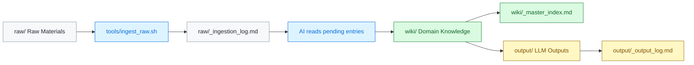

<div align="center">

**English** | [中文](README_zh.md)

<h1>Knowledge Vault</h1>
<p><strong>AI-Assisted Personal Knowledge Base</strong></p>

<p>
  <a href="https://github.com/KkOma-value/vault/commits/master"></a>
  <a href="https://github.com/KkOma-value/vault"></a>
  <a href="tools/ingest_raw.sh"></a>
</p>

<p><strong><code>raw</code> &rarr; <code>wiki</code> &rarr; <code>output</code></strong></p>

<p>Turn raw materials, AI-curated knowledge, and LLM outputs into a trackable, searchable, reusable personal knowledge system.</p>

<p>
  <a href="#quick-start">Quick Start</a> ·
  <a href="#core-workflow">Core Workflow</a> ·
  <a href="#ai-protocol">AI Protocol</a> ·
  <a href="#tools">Tools</a>
</p>

</div>

---

Knowledge Vault is a lightweight repository template for personal knowledge management. It works well with Obsidian, Git, and AI assistants: drop PDFs, Markdown files, Word documents, images, etc. into `raw/`, run the ingestion script to register files, then let AI archive them into `wiki/` following predefined rules. All summaries, reports, and drafts go into `output/`.

## At a Glance

| Layer | Purpose | What Goes Here |
|-------|---------|----------------|
| [`raw/`](raw/) | Raw material layer — preserves original sources | PDFs, Markdown, images, Word docs, web clippings |
| [`wiki/`](wiki/) | Knowledge layer — AI or human-curated knowledge | Domain indexes, topic notes, source tracing, related links |
| [`output/`](output/) | Output layer — LLM-generated artifacts | Summaries, reports, article drafts, analysis results |

Core goals:

- Preserve original files without altering sources.
- Every knowledge file traces back to its raw source.
- Use indexes for fast lookup by domain, topic, and related knowledge.
- Give AI a fixed protocol for processing files instead of ad-hoc behavior.

## Quick Start

Clone the repository:

```bash
git clone https://github.com/KkOma-value/vault.git
cd vault
```

Place raw files into the appropriate `raw/` subdirectory:

```text
raw/pdf/      # PDFs
raw/md/       # Markdown
raw/img/      # Images
raw/docx/     # Word documents
raw/misc/     # Other files
```

Register new files:

```bash
./tools/ingest_raw.sh
```

Then ask AI to process `pending` files:

```text
Process all pending files in raw/_ingestion_log.md.
Use wiki/_taxonomy.md to determine domain assignment.
If an existing domain fits, update it; otherwise create a new one.
After processing, update the domain _index.md, wiki/_master_index.md,
and change the ingestion log status to processed.
```

## Core Workflow


```mermaid
flowchart LR
    A["raw/ Raw Materials"] --> B["tools/ingest_raw.sh"]
    B --> C["raw/_ingestion_log.md"]
    C --> D["AI reads pending entries"]
    D --> E["wiki/ Domain Knowledge"]
    E --> F["wiki/_master_index.md"]
    E --> G["output/ LLM Outputs"]
    G --> H["output/_output_log.md"]

    classDef source fill:#f6f8fa,stroke:#8c959f,color:#24292f;
    classDef tool fill:#ddf4ff,stroke:#0969da,color:#0969da;
    classDef knowledge fill:#dafbe1,stroke:#1a7f37,color:#116329;
    classDef output fill:#fff8c5,stroke:#9a6700,color:#7d4e00;

    class A,C source;
    class B,D tool;
    class E,F knowledge;
    class G,H output;
```

Processing logic:

1. `raw/` stores original files.
2. `ingest_raw.sh` scans for new files, computes SHA-256 prefixes, and registers them as `pending`.
3. AI uses [`wiki/_taxonomy.md`](wiki/_taxonomy.md) to determine the domain.
4. AI uses [`wiki/_templates/`](wiki/_templates/) to create or update knowledge files.
5. Domain indexes and the master index are updated accordingly.
6. LLM outputs go into `output/` separately, keeping them distinct from knowledge sources.

## Directory Structure

```text
.
├── raw/
│   ├── _ingestion_log.md
│   ├── pdf/
│   ├── md/
│   ├── img/
│   ├── docx/
│   └── misc/
├── wiki/
│   ├── _master_index.md
│   ├── _taxonomy.md
│   ├── _templates/
│   └── <domain>/
│       ├── _index.md
│       └── <topic>.md
├── output/
│   ├── _output_log.md
│   ├── summaries/
│   ├── reports/
│   └── drafts/
└── tools/
    ├── ingest_raw.sh
    ├── README.md
    └── tests/
```

## Example

Suppose you add a new RAG note:

```text
raw/md/rag-notes.md
```

After running the ingestion script, `raw/_ingestion_log.md` will have a new entry:

```markdown
| Raw File | SHA-256 | Ingested | Wiki Target | Status |
|----------|---------|----------|-------------|--------|
| md/rag-notes.md | 9f86d081884c | 2026-05-29 | -- | pending |
```

After AI processing, the following may be created:

```text
wiki/rag/
├── _index.md
└── rag-pipeline.md
```

The knowledge file retains source tracing:

```markdown
# RAG Pipeline

<!--
source_raw_files:
  - raw/md/rag-notes.md
domain: rag
tags: rag, retrieval, generation
-->

## Summary

RAG combines external knowledge retrieval with large language model generation.
A typical pipeline includes document loading, chunking, vectorization,
retrieval, reranking, and generation.
```

The ingestion log is then updated:

```markdown
| Raw File | SHA-256 | Ingested | Wiki Target | Status |
|----------|---------|----------|-------------|--------|
| md/rag-notes.md | 9f86d081884c | 2026-05-29 | wiki/rag/ | processed |
```

## AI Protocol

When AI processes this repository, it must follow these rules:

- Never modify the contents of original files in `raw/`.
- Read [`wiki/_taxonomy.md`](wiki/_taxonomy.md) before deciding on a domain.
- Prefer updating existing domains; only create new ones when no existing domain fits.
- New domains must include an `_index.md`.
- New knowledge files must retain source tracing.
- After updating knowledge files, sync the domain `_index.md` and [`wiki/_master_index.md`](wiki/_master_index.md).
- After processing raw files, update [`raw/_ingestion_log.md`](raw/_ingestion_log.md).
- After generating LLM output, update [`output/_output_log.md`](output/_output_log.md).
- Do not copy large sections of original text into wiki; wiki stores curated knowledge.

## Tools

Register new raw files:

```bash
./tools/ingest_raw.sh
```

Run ingestion script tests:

```bash
./tools/tests/test_ingest_raw.sh
```

Check Git status:

```bash
git status
```

Commit knowledge base changes:

```bash
git add .
git commit -m "docs: update knowledge vault"
```

## Current Scope

What's already in place:

- Three-layer directory structure
- Ingestion log
- Master index
- Taxonomy rules
- Wiki templates
- Output log
- Raw file registration script
- Script tests
- Git version control

There is currently no background watcher or fully automated archiving service. After adding new files, you need to manually run:

```bash
./tools/ingest_raw.sh
```

Then ask AI to process the `pending` entries.

## License

This repository has not yet declared an open-source license. Although the repository is public, no rights to reuse, distribute, or modify are granted until a `LICENSE` file is added.

## References

The structure of this README draws from:

- [GitHub official README guidelines](https://docs.github.com/en/repositories/managing-your-repositorys-settings-and-features/customizing-your-repository/about-readmes)
- [Google README style guide](https://google.github.io/styleguide/docguide/READMEs.html)
- High-star repositories such as [React](https://github.com/facebook/react), [Next.js](https://github.com/vercel/next.js), [nvm](https://github.com/nvm-sh/nvm), [Oh My Zsh](https://github.com/ohmyzsh/ohmyzsh), [freeCodeCamp](https://github.com/freeCodeCamp/freeCodeCamp), [awesome](https://github.com/sindresorhus/awesome), and [free-programming-books](https://github.com/EbookFoundation/free-programming-books).
